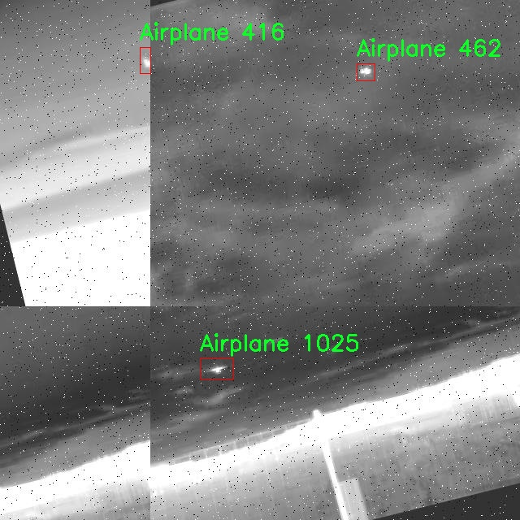

# 红外画面空中目标检测检测系统源码分享
 # [一条龙教学YOLOV8标注好的数据集一键训练_70+全套改进创新点发刊_Web前端展示]

### 1.研究背景与意义

项目参考[AAAI Association for the Advancement of Artificial Intelligence](https://gitee.com/qunmasj/projects)

项目来源[AACV Association for the Advancement of Computer Vision](https://kdocs.cn/l/cszuIiCKVNis)

研究背景与意义

随着无人机技术和航空器应用的迅速发展，空中目标检测的需求日益增长，尤其是在安全监控、交通管理和军事侦察等领域。传统的目标检测方法在复杂环境下的表现往往不尽如人意，尤其是在低光照或恶劣天气条件下。红外成像技术因其在夜间和复杂气候条件下的优越性能，逐渐成为空中目标检测的重要手段。针对这一背景，基于改进YOLOv8的红外画面空中目标检测系统的研究显得尤为重要。

YOLO（You Only Look Once）系列模型因其高效的实时检测能力和较好的检测精度，已广泛应用于各类目标检测任务。YOLOv8作为该系列的最新版本，结合了深度学习的先进技术，具备了更强的特征提取能力和更快的推理速度。然而，现有的YOLOv8模型在处理红外图像时，仍面临着目标特征模糊、背景干扰等问题。因此，针对红外图像的特性，对YOLOv8进行改进，提升其在空中目标检测中的表现，具有重要的研究意义。

本研究所使用的数据集包含7800幅图像，涵盖了四类空中目标：飞机、鸟、无人机和直升机。这些目标在红外图像中的表现各异，且背景复杂多变。通过对这些数据的深入分析，可以更好地理解不同目标在红外成像下的特征，从而为改进YOLOv8模型提供有力的支持。具体而言，研究将着重于特征增强、背景抑制和多尺度检测等方面，以提高模型在红外图像中的检测精度和鲁棒性。

此外，随着智能交通、无人机监控等应用场景的不断拓展，空中目标检测的实时性和准确性愈发重要。基于改进YOLOv8的红外画面空中目标检测系统，不仅能够提升检测效率，还能为相关领域提供更加可靠的技术支持。通过实现高效的目标检测，可以有效地降低空中交通事故的发生率，提高空域安全性。同时，该系统的成功应用也将为无人机自主飞行、智能监控等技术的发展奠定基础。

综上所述，基于改进YOLOv8的红外画面空中目标检测系统的研究，不仅具有重要的理论价值，还具备广泛的应用前景。通过对红外图像特征的深入挖掘和YOLOv8模型的优化，研究将为空中目标检测技术的发展提供新的思路和方法，为实现智能化、自动化的空中监控和管理贡献力量。

### 2.图片演示


##### 注意：由于此博客编辑较早，上面“2.图片演示”和“3.视频演示”展示的系统图片或者视频可能为老版本，新版本在老版本的基础上升级如下：（实际效果以升级的新版本为准）

  （1）适配了YOLOV8的“目标检测”模型和“实例分割”模型，通过加载相应的权重（.pt）文件即可自适应加载模型。

  （2）支持“图片识别”、“视频识别”、“摄像头实时识别”三种识别模式。

  （3）支持“图片识别”、“视频识别”、“摄像头实时识别”三种识别结果保存导出，解决手动导出（容易卡顿出现爆内存）存在的问题，识别完自动保存结果并导出到tempDir中。

  （4）支持Web前端系统中的标题、背景图等自定义修改，后面提供修改教程。

  另外本项目提供训练的数据集和训练教程,暂不提供权重文件（best.pt）,需要您按照教程进行训练后实现图片演示和Web前端界面演示的效果。

### 3.视频演示

[3.1 视频演示](https://www.bilibili.com/video/BV12x4uecEhB/)

### 4.数据集信息展示

##### 4.1 本项目数据集详细数据（类别数＆类别名）

nc: 4
names: ['Airplane', 'Bird', 'Drone', 'Helicopter']


##### 4.2 本项目数据集信息介绍

数据集信息展示

在现代计算机视觉领域，尤其是在空中目标检测的研究中，数据集的构建与选择至关重要。本研究所采用的数据集名为“Air Vehicles”，专门针对红外画面中的空中目标检测任务而设计。该数据集包含四个主要类别，分别是“Airplane”（飞机）、“Bird”（鸟类）、“Drone”（无人机）和“Helicopter”（直升机）。这些类别的选择不仅涵盖了多种常见的空中目标，还反映了当前无人机技术和航空活动的快速发展。

“Air Vehicles”数据集的构建过程注重数据的多样性和代表性，确保模型在不同环境和条件下的鲁棒性。数据集中包含的图像均为红外图像，这种图像类型在低光照和恶劣天气条件下表现出色，能够有效捕捉到目标的热辐射特征。通过使用红外成像技术，研究者能够在夜间或视距受限的情况下进行目标检测，这对于军事监视、无人机巡逻以及野生动物观察等应用场景尤为重要。

在数据集的标注过程中，采用了精确的框选和分类方法，确保每个目标的边界框准确无误。每个类别的样本数量经过精心设计，以保证模型在训练过程中能够获得均衡的学习机会。例如，飞机和直升机通常在特定的航线上飞行，而鸟类和无人机则可能在更广泛的环境中活动。因此，数据集中不仅包含了在不同高度和速度下的目标图像，还考虑了不同的背景和气候条件，以增强模型的泛化能力。

为了提高数据集的实用性和有效性，研究团队还进行了数据增强处理，包括旋转、缩放、翻转等操作。这些操作不仅增加了数据集的样本数量，还丰富了样本的多样性，使得模型在面对真实世界中的各种变化时，能够保持较高的检测精度。此外，数据集还包含了不同时间段和地点拍摄的图像，以模拟不同的操作环境和场景变化，从而进一步提升模型的适应性。

在模型训练过程中，使用“Air Vehicles”数据集将有助于改进YOLOv8的性能。YOLOv8作为一种先进的目标检测算法，其高效性和准确性使其成为本研究的理想选择。通过在“Air Vehicles”数据集上进行训练，模型能够学习到不同类别目标的特征，进而在实际应用中实现快速、准确的目标检测。

总之，“Air Vehicles”数据集为改进YOLOv8的红外画面空中目标检测系统提供了坚实的基础。通过对数据集的精心设计和多样化处理，研究者能够有效提升模型的性能，使其在复杂的空中目标检测任务中表现出色。这不仅为相关领域的研究提供了重要的数据支持，也为未来的技术发展奠定了基础。





### 5.全套项目环境部署视频教程（零基础手把手教学）

[5.1 环境部署教程链接（零基础手把手教学）](https://www.ixigua.com/7404473917358506534?logTag=c807d0cbc21c0ef59de5)


[5.2 安装Python虚拟环境创建和依赖库安装视频教程链接（零基础手把手教学）](https://www.ixigua.com/7404474678003106304?logTag=1f1041108cd1f708b01a)

### 6.手把手YOLOV8训练视频教程（零基础小白有手就能学会）

[6.1 手把手YOLOV8训练视频教程（零基础小白有手就能学会）](https://www.ixigua.com/7404477157818401292?logTag=d31a2dfd1983c9668658)

### 7.70+种全套YOLOV8创新点代码加载调参视频教程（一键加载写好的改进模型的配置文件）

[7.1 70+种全套YOLOV8创新点代码加载调参视频教程（一键加载写好的改进模型的配置文件）](https://www.ixigua.com/7404478314661806627?logTag=29066f8288e3f4eea3a4)

### 8.70+种全套YOLOV8创新点原理讲解（非科班也可以轻松写刊发刊，V10版本正在科研待更新）

由于篇幅限制，每个创新点的具体原理讲解就不一一展开，具体见下列网址中的创新点对应子项目的技术原理博客网址【Blog】：


[8.1 70+种全套YOLOV8创新点原理讲解链接](https://gitee.com/qunmasj/good)

### 9.系统功能展示（检测对象为举例，实际内容以本项目数据集为准）

图9.1.系统支持检测结果表格显示

  图9.2.系统支持置信度和IOU阈值手动调节

  图9.3.系统支持自定义加载权重文件best.pt(需要你通过步骤5中训练获得)

  图9.4.系统支持摄像头实时识别

  图9.5.系统支持图片识别

  图9.6.系统支持视频识别

  图9.7.系统支持识别结果文件自动保存

  图9.8.系统支持Excel导出检测结果数据


### 10.原始YOLOV8算法原理

原始YOLOv8算法原理

YOLOv8算法是YOLO系列中的最新版本，代表了单阶段目标检测技术的又一次重大进步。该算法在设计上兼顾了检测精度与速度，旨在为各种应用场景提供高效的解决方案。YOLOv8的架构由四个主要部分组成：输入层、Backbone骨干网络、Neck特征融合网络和Head检测模块。这一结构的设计理念是通过精简和优化各个模块，提升整体性能，同时保持实时性和轻量化特性。

在输入层，YOLOv8首先对输入图像进行预处理，包括图像比例调整、Mosaic增强和自适应锚框计算。Mosaic增强技术通过将多张图像合成一张新图像，丰富了训练数据的多样性，从而提高了模型的泛化能力。此外，自适应锚框计算能够根据输入图像的特征动态生成锚框，提高了目标检测的准确性。

YOLOv8的Backbone部分采用了经过优化的DarkNet结构，核心在于引入了C2f模块，替代了传统的C3模块。C2f模块通过更丰富的分支和跨层连接，增强了梯度流动，使得特征提取更加高效。与YOLOv7的ELAN结构相似，C2f模块通过多路径的特征学习，提升了网络的特征表示能力。同时，YOLOv8在不同尺度的模型中调整了通道数，以适应不同的目标检测需求。SPPF模块的引入进一步增强了特征图的处理能力，通过不同内核尺寸的池化操作，有效地合并了特征图的信息，为后续的特征融合打下了坚实的基础。

Neck部分则采用了双塔结构，结合了特征金字塔和路径聚合网络（PAN），实现了对不同尺度目标特征的有效融合。特征金字塔网络通过多层次的特征提取，确保了网络能够捕捉到不同尺度目标的语义信息，而路径聚合网络则促进了语义特征与定位特征之间的有效转移。这种特征融合策略显著提高了YOLOv8在多尺度目标检测中的表现，使得模型在面对复杂场景时依然能够保持高精度的检测能力。

在Head检测模块中，YOLOv8采用了解耦头的结构，将回归分支和预测分支进行分离。这一设计的优势在于加速了模型的收敛过程，同时提高了检测的准确性。检测模块包含三个Detect检测器，分别负责不同尺寸目标的检测任务。通过解耦结构，YOLOv8能够在分类和回归过程中更灵活地处理正负样本的分配，采用Task-Aligned Assigner策略，确保正样本的选择更加合理。此外，YOLOv8在损失计算中引入了二元交叉熵损失（BCELoss）和分布焦点损失（DFLoss），结合完全交并比损失函数（CIOULoss），进一步提升了模型对边界框预测的精准性。

YOLOv8相较于前代版本，尤其是YOLOv5，进行了多项重要改进。新的骨干网络和头部网络的设计，使得YOLOv8在保持轻量化的同时，显著提升了模型的性能。C2f结构的引入，不仅增强了梯度流动，还优化了特征提取的效率。此外，YOLOv8在头部网络中采用了无锚框检测头，减少了锚框预测的数量，从而加速了非最大抑制（NMS）过程，提高了检测速度。

YOLOv8的多样化模型设计也是其一大亮点。根据不同的应用需求，YOLOv8提供了n、s、m、l、x五种不同规模的模型，网络深度和检测精度逐步增加。YOLOv8n作为参数量最小、检测速度最快的版本，特别适合实时性要求高的场景。而YOLOv8x则适用于对检测精度要求极高的应用，展示了YOLOv8在灵活性和适应性方面的优势。

综上所述，YOLOv8算法通过对输入、Backbone、Neck和Head各个模块的精心设计与优化，形成了一种高效、准确的目标检测解决方案。其创新的结构和算法设计，使得YOLOv8在多种应用场景中表现出色，成为了当前目标检测领域的重要工具。随着技术的不断进步，YOLOv8有望在未来的研究和应用中继续发挥重要作用，推动目标检测技术的进一步发展。


### 11.项目核心源码讲解（再也不用担心看不懂代码逻辑）

#### 11.1 70+种YOLOv8算法改进源码大全和调试加载训练教程（非必要）\ultralytics\nn\extra_modules\orepa.py

以下是对给定代码的核心部分进行提炼和详细注释的结果。主要保留了 `OREPA`、`OREPA_LargeConv`、`ConvBN` 和 `RepVGGBlock_OREPA` 类的实现，去掉了一些冗余的部分和未使用的函数。

```python
import torch
import torch.nn as nn
import torch.nn.init as init
import torch.nn.functional as F
import numpy as np

# OREPA类实现
class OREPA(nn.Module):
    def __init__(self, in_channels, out_channels, kernel_size=3, stride=1, padding=None, groups=1, dilation=1, act=True):
        super(OREPA, self).__init__()
        self.nonlinear = nn.ReLU() if act else nn.Identity()  # 激活函数选择
        self.kernel_size = kernel_size
        self.in_channels = in_channels
        self.out_channels = out_channels
        self.groups = groups
        self.stride = stride
        self.padding = padding if padding is not None else (kernel_size // 2)  # 默认填充
        self.dilation = dilation

        # 初始化权重参数
        self.weight_orepa_origin = nn.Parameter(torch.Tensor(out_channels, in_channels // groups, kernel_size, kernel_size))
        init.kaiming_uniform_(self.weight_orepa_origin)  # 权重初始化

        # 其他分支的权重参数
        self.weight_orepa_avg_conv = nn.Parameter(torch.Tensor(out_channels, in_channels // groups, 1, 1))
        init.kaiming_uniform_(self.weight_orepa_avg_conv)

        self.vector = nn.Parameter(torch.Tensor(6, out_channels))  # 权重组合向量
        self.bn = nn.BatchNorm2d(out_channels)  # 批归一化层

    def weight_gen(self):
        # 生成最终的卷积权重
        weight_orepa_origin = self.weight_orepa_origin * self.vector[0, :].view(-1, 1, 1, 1)
        weight_orepa_avg = self.weight_orepa_avg_conv * self.vector[1, :].view(-1, 1, 1, 1)
        weight = weight_orepa_origin + weight_orepa_avg  # 权重相加
        return weight

    def forward(self, inputs):
        weight = self.weight_gen()  # 生成权重
        out = F.conv2d(inputs, weight, stride=self.stride, padding=self.padding, dilation=self.dilation, groups=self.groups)
        return self.nonlinear(self.bn(out))  # 激活和归一化

# OREPA_LargeConv类实现
class OREPA_LargeConv(nn.Module):
    def __init__(self, in_channels, out_channels, kernel_size=1, stride=1, padding=None, groups=1, dilation=1, act=True):
        super(OREPA_LargeConv, self).__init__()
        self.stride = stride
        self.padding = padding if padding is not None else (kernel_size // 2)
        self.layers = (kernel_size - 1) // 2  # 计算层数
        self.groups = groups
        self.nonlinear = nn.ReLU() if act else nn.Identity()

        # 初始化多个OREPA层
        self.weights = nn.ModuleList()
        for i in range(self.layers):
            if i == 0:
                self.weights.append(OREPA(in_channels, out_channels, kernel_size=3, stride=1, padding=1, groups=groups))
            elif i == self.layers - 1:
                self.weights.append(OREPA(out_channels, out_channels, kernel_size=3, stride=stride, padding=1, groups=groups))
            else:
                self.weights.append(OREPA(out_channels, out_channels, kernel_size=3, stride=1, padding=1, groups=groups))

    def forward(self, inputs):
        weight = inputs
        for layer in self.weights:
            weight = layer(weight)  # 逐层传递
        return self.nonlinear(weight)  # 激活

# ConvBN类实现
class ConvBN(nn.Module):
    def __init__(self, in_channels, out_channels, kernel_size, stride=1, padding=0, dilation=1, groups=1):
        super().__init__()
        self.conv = nn.Conv2d(in_channels, out_channels, kernel_size, stride=stride, padding=padding, dilation=dilation, groups=groups, bias=False)
        self.bn = nn.BatchNorm2d(out_channels)  # 批归一化

    def forward(self, x):
        return self.bn(self.conv(x))  # 先卷积后归一化

# RepVGGBlock_OREPA类实现
class RepVGGBlock_OREPA(nn.Module):
    def __init__(self, in_channels, out_channels, kernel_size=3, stride=1, padding=None, groups=1, act=True):
        super(RepVGGBlock_OREPA, self).__init__()
        self.nonlinearity = nn.ReLU() if act else nn.Identity()
        self.rbr_dense = OREPA(in_channels, out_channels, kernel_size=kernel_size, stride=stride, padding=padding, groups=groups)
        self.rbr_1x1 = ConvBN(in_channels, out_channels, kernel_size=1, stride=stride, groups=groups)

    def forward(self, inputs):
        out1 = self.rbr_dense(inputs)  # 主分支
        out2 = self.rbr_1x1(inputs)  # 1x1卷积分支
        return self.nonlinearity(out1 + out2)  # 相加并激活
```

### 代码说明
1. **OREPA类**: 这是一个卷积模块，使用多个卷积分支组合生成最终的卷积权重。支持批归一化和激活函数。
2. **OREPA_LargeConv类**: 该类由多个OREPA层组成，适用于大卷积核的情况。通过层叠多个OREPA模块来构建更复杂的卷积操作。
3. **ConvBN类**: 这是一个简单的卷积层，后接批归一化，提供了标准的卷积操作。
4. **RepVGGBlock_OREPA类**: 这是一个复合模块，结合了OREPA和1x1卷积，形成一个完整的块，适用于更复杂的网络结构。

这些核心部分构成了一个高效的卷积神经网络模块，适用于图像处理和计算机视觉任务。

这个文件定义了一些用于深度学习模型的模块，主要是基于PyTorch框架的自定义卷积层和相关操作。文件中包含了多个类，分别实现了不同的功能，以下是对主要内容的详细说明。

首先，文件引入了必要的库，包括PyTorch的核心模块、数学库和NumPy。接着，定义了一些辅助函数，例如`transI_fusebn`和`transVI_multiscale`，用于处理卷积核和批归一化的融合，以及对卷积核进行多尺度填充。

`OREPA`类是一个自定义的卷积模块，包含了多个卷积分支，支持多种卷积操作。它的构造函数接受多个参数，如输入和输出通道数、卷积核大小、步幅、填充、分组卷积等。根据是否处于部署模式，类内部会创建不同的卷积层。在非部署模式下，模块会初始化多个卷积权重，并通过不同的方式组合这些权重生成最终的卷积核。

`OREPA_LargeConv`类则是一个大卷积模块，主要用于处理大卷积核的情况。它的构造函数类似于`OREPA`，但它会创建多个`OREPA`实例来组合成更大的卷积操作。

`ConvBN`类是一个简单的卷积层，后接批归一化层。它的构造函数根据是否处于部署模式选择是否创建批归一化层，并在前向传播中执行相应的操作。

`OREPA_3x3_RepVGG`类是一个特定的卷积模块，结合了`OREPA`和RepVGG的思想，主要用于3x3卷积操作。它的构造函数中也包含了多个卷积分支，并在初始化时对权重进行处理。

最后，`RepVGGBlock_OREPA`类是一个复合模块，结合了多个卷积分支和可选的SE注意力机制。它的前向传播方法将不同分支的输出相加，并通过非线性激活函数进行处理。

整个文件的设计旨在提高卷积操作的灵活性和效率，适用于各种深度学习任务，尤其是在计算机视觉领域。通过模块化的设计，用户可以根据需要选择不同的卷积结构和参数设置，以适应不同的应用场景。

#### 11.2 70+种YOLOv8算法改进源码大全和调试加载训练教程（非必要）\ultralytics\nn\backbone\repvit.py

以下是代码中最核心的部分，并附上详细的中文注释：

```python
import torch.nn as nn
import torch

# 定义RepViT模型的基本模块
class Conv2d_BN(torch.nn.Sequential):
    def __init__(self, a, b, ks=1, stride=1, pad=0, dilation=1, groups=1, bn_weight_init=1):
        super().__init__()
        # 添加卷积层
        self.add_module('c', torch.nn.Conv2d(a, b, ks, stride, pad, dilation, groups, bias=False))
        # 添加批归一化层
        self.add_module('bn', torch.nn.BatchNorm2d(b))
        # 初始化批归一化层的权重
        torch.nn.init.constant_(self.bn.weight, bn_weight_init)
        torch.nn.init.constant_(self.bn.bias, 0)

    @torch.no_grad()
    def fuse_self(self):
        # 融合卷积层和批归一化层
        c, bn = self._modules.values()
        w = bn.weight / (bn.running_var + bn.eps)**0.5  # 计算卷积权重
        w = c.weight * w[:, None, None, None]  # 应用批归一化权重
        b = bn.bias - bn.running_mean * bn.weight / (bn.running_var + bn.eps)**0.5  # 计算偏置
        m = torch.nn.Conv2d(w.size(1) * self.c.groups, w.size(0), w.shape[2:], stride=self.c.stride, padding=self.c.padding, dilation=self.c.dilation, groups=self.c.groups)
        m.weight.data.copy_(w)  # 复制权重
        m.bias.data.copy_(b)  # 复制偏置
        return m  # 返回融合后的卷积层

class Residual(torch.nn.Module):
    def __init__(self, m, drop=0.):
        super().__init__()
        self.m = m  # 保存模块
        self.drop = drop  # 丢弃率

    def forward(self, x):
        # 前向传播，添加残差连接
        if self.training and self.drop > 0:
            return x + self.m(x) * torch.rand(x.size(0), 1, 1, 1, device=x.device).ge_(self.drop).div(1 - self.drop).detach()
        else:
            return x + self.m(x)

class RepViTBlock(nn.Module):
    def __init__(self, inp, hidden_dim, oup, kernel_size, stride, use_se, use_hs):
        super(RepViTBlock, self).__init__()
        assert stride in [1, 2]
        self.identity = stride == 1 and inp == oup  # 判断是否需要恒等映射
        assert(hidden_dim == 2 * inp)  # 确保隐藏维度是输入维度的两倍

        if stride == 2:
            # 当步幅为2时，使用Token混合器和通道混合器
            self.token_mixer = nn.Sequential(
                Conv2d_BN(inp, inp, kernel_size, stride, (kernel_size - 1) // 2, groups=inp),
                nn.Identity() if not use_se else SqueezeExcite(inp, 0.25),
                Conv2d_BN(inp, oup, ks=1, stride=1, pad=0)
            )
            self.channel_mixer = Residual(nn.Sequential(
                Conv2d_BN(oup, 2 * oup, 1, 1, 0),
                nn.GELU() if use_hs else nn.GELU(),
                Conv2d_BN(2 * oup, oup, 1, 1, 0, bn_weight_init=0),
            ))
        else:
            assert(self.identity)
            # 当步幅为1时，使用不同的结构
            self.token_mixer = nn.Sequential(
                RepVGGDW(inp),
                nn.Identity() if not use_se else SqueezeExcite(inp, 0.25),
            )
            self.channel_mixer = Residual(nn.Sequential(
                Conv2d_BN(inp, hidden_dim, 1, 1, 0),
                nn.GELU() if use_hs else nn.GELU(),
                Conv2d_BN(hidden_dim, oup, 1, 1, 0, bn_weight_init=0),
            ))

    def forward(self, x):
        # 前向传播
        return self.channel_mixer(self.token_mixer(x))

class RepViT(nn.Module):
    def __init__(self, cfgs):
        super(RepViT, self).__init__()
        self.cfgs = cfgs  # 保存配置
        input_channel = self.cfgs[0][2]  # 获取输入通道数
        # 构建初始层
        patch_embed = torch.nn.Sequential(Conv2d_BN(3, input_channel // 2, 3, 2, 1), torch.nn.GELU(),
                                           Conv2d_BN(input_channel // 2, input_channel, 3, 2, 1))
        layers = [patch_embed]
        # 构建反向残差块
        block = RepViTBlock
        for k, t, c, use_se, use_hs, s in self.cfgs:
            output_channel = _make_divisible(c, 8)  # 确保输出通道数可被8整除
            exp_size = _make_divisible(input_channel * t, 8)  # 确保扩展通道数可被8整除
            layers.append(block(input_channel, exp_size, output_channel, k, s, use_se, use_hs))
            input_channel = output_channel  # 更新输入通道数
        self.features = nn.ModuleList(layers)  # 保存所有层

    def forward(self, x):
        # 前向传播，返回特征
        input_size = x.size(2)
        scale = [4, 8, 16, 32]
        features = [None, None, None, None]
        for f in self.features:
            x = f(x)
            if input_size // x.size(2) in scale:
                features[scale.index(input_size // x.size(2))] = x
        return features  # 返回特征图

def repvit_m0_9(weights=''):
    """
    构建RepViT模型
    """
    cfgs = [
        # k, t, c, SE, HS, s 
        [3, 2, 48, 1, 0, 1],
        # ... 省略其他配置
    ]
    model = RepViT(cfgs)  # 创建模型
    if weights:
        model.load_state_dict(update_weight(model.state_dict(), torch.load(weights)['model']))  # 加载权重
    return model  # 返回模型
```

### 代码核心部分解释：
1. **Conv2d_BN**：这是一个包含卷积层和批归一化层的模块。它提供了一个方法 `fuse_self` 来融合这两个层，以提高推理速度。
2. **Residual**：实现了残差连接，允许在网络中添加跳跃连接以缓解梯度消失问题。
3. **RepViTBlock**：构建了RepViT的基本块，支持不同的步幅和通道混合方式。
4. **RepViT**：整个模型的主体，负责根据配置构建网络的各个层，并在前向传播中返回特征图。
5. **repvit_m0_9**：这是一个工厂函数，用于创建RepViT模型并加载预训练权重。

这些部分构成了RepViT模型的核心结构，支持高效的图像处理和特征提取。

这个程序文件定义了一个基于RepVGG结构的深度学习模型，主要用于计算机视觉任务。文件中包含多个类和函数，具体功能如下：

首先，导入了必要的库，包括PyTorch和NumPy，以及用于构建Squeeze-and-Excite模块的`timm`库。接着，定义了一个`replace_batchnorm`函数，该函数用于替换网络中的BatchNorm层为Identity层，以便在推理时加速计算。

`_make_divisible`函数确保所有层的通道数都是8的倍数，这在模型设计中是一个常见的约定，尤其是在移动设备上运行的模型中。

接下来，定义了`Conv2d_BN`类，它是一个组合了卷积层和BatchNorm层的顺序容器，并在初始化时设置了BatchNorm的权重和偏置。`fuse_self`方法用于将卷积层和BatchNorm层融合为一个卷积层，以提高推理速度。

`Residual`类实现了残差连接，允许在训练时添加随机丢弃，以增强模型的鲁棒性。它同样实现了`fuse_self`方法，用于融合卷积层和BatchNorm层。

`RepVGGDW`类是RepVGG的深度可分离卷积实现，包含两个卷积层和一个BatchNorm层。它的`forward`方法定义了前向传播的计算过程。

`RepViTBlock`类实现了RepViT的基本构建块，包含了通道混合和标记混合的操作，支持不同的步幅和是否使用Squeeze-and-Excite模块。

`RepViT`类是整个模型的主体，负责构建网络的各个层。它根据配置参数构建多个RepViT块，并在前向传播中提取特征。

`update_weight`函数用于更新模型的权重，确保新加载的权重与模型的结构匹配。

最后，定义了多个函数（如`repvit_m0_9`、`repvit_m1_0`等），这些函数根据不同的配置构建RepViT模型，并可以选择加载预训练的权重。

在文件的最后部分，使用`if __name__ == '__main__':`语句来测试模型的构建和前向传播，生成一个随机输入并打印输出特征的尺寸。

整体来看，这个文件实现了一个灵活且高效的深度学习模型，适用于图像分类等任务，具有良好的模块化设计和可扩展性。

#### 11.3 ui.py

以下是代码中最核心的部分，并附上详细的中文注释：

```python
import sys
import subprocess

def run_script(script_path):
    """
    使用当前 Python 环境运行指定的脚本。

    Args:
        script_path (str): 要运行的脚本路径

    Returns:
        None
    """
    # 获取当前 Python 解释器的路径
    python_path = sys.executable

    # 构建运行命令，使用 streamlit 运行指定的脚本
    command = f'"{python_path}" -m streamlit run "{script_path}"'

    # 执行命令
    result = subprocess.run(command, shell=True)
    # 检查命令执行的返回码，如果不为0则表示出错
    if result.returncode != 0:
        print("脚本运行出错。")

# 实例化并运行应用
if __name__ == "__main__":
    # 指定要运行的脚本路径
    script_path = "web.py"  # 这里可以替换为实际的脚本路径

    # 调用函数运行脚本
    run_script(script_path)
```

### 代码注释说明：
1. **导入模块**：
   - `sys`：用于访问与 Python 解释器紧密相关的变量和函数。
   - `subprocess`：用于执行外部命令。

2. **`run_script` 函数**：
   - 功能：使用当前 Python 环境运行指定的脚本。
   - 参数：`script_path`，要运行的脚本的路径。
   - 获取当前 Python 解释器的路径，构建一个命令字符串，使用 `streamlit` 模块运行指定的脚本。
   - 使用 `subprocess.run` 执行命令，并检查返回码以判断脚本是否成功运行。

3. **主程序块**：
   - 检查是否为主模块运行，如果是，则指定要运行的脚本路径并调用 `run_script` 函数。

这个程序文件名为 `ui.py`，其主要功能是通过当前的 Python 环境运行一个指定的脚本，具体来说是运行一个名为 `web.py` 的脚本。程序首先导入了必要的模块，包括 `sys`、`os` 和 `subprocess`，这些模块分别用于系统相关的操作、文件路径处理和执行外部命令。

在 `run_script` 函数中，首先获取当前 Python 解释器的路径，这样可以确保使用正确的 Python 环境来运行脚本。接着，构建一个命令字符串，这个命令使用 `streamlit` 模块来运行指定的脚本。`streamlit` 是一个用于构建数据应用的库，命令的格式是 `"python_path" -m streamlit run "script_path"`，其中 `python_path` 是当前 Python 解释器的路径，`script_path` 是要运行的脚本路径。

然后，使用 `subprocess.run` 方法执行这个命令。该方法会在一个新的 shell 中运行命令，并返回一个结果对象。通过检查 `result.returncode`，可以判断脚本是否成功运行。如果返回码不为零，表示脚本运行出错，程序会输出一条错误信息。

在文件的最后部分，使用 `if __name__ == "__main__":` 语句来确保只有在直接运行该文件时才会执行下面的代码。这里指定了要运行的脚本路径为 `web.py`，并调用 `run_script` 函数来执行这个脚本。

整体来看，这个程序的结构清晰，功能明确，主要用于启动一个基于 Streamlit 的 Web 应用。

#### 11.4 70+种YOLOv8算法改进源码大全和调试加载训练教程（非必要）\ultralytics\trackers\basetrack.py

以下是代码中最核心的部分，并附上详细的中文注释：

```python
from collections import OrderedDict
import numpy as np

class TrackState:
    """对象跟踪状态的枚举类。"""
    New = 0      # 新建状态
    Tracked = 1  # 被跟踪状态
    Lost = 2     # 丢失状态
    Removed = 3  # 被移除状态

class BaseTrack:
    """对象跟踪的基类，处理基本的跟踪属性和操作。"""

    _count = 0  # 全局跟踪ID计数器

    track_id = 0  # 当前跟踪的ID
    is_activated = False  # 跟踪是否被激活
    state = TrackState.New  # 跟踪的初始状态

    history = OrderedDict()  # 存储跟踪历史的有序字典
    features = []  # 存储特征的列表
    curr_feature = None  # 当前特征
    score = 0  # 跟踪的分数
    start_frame = 0  # 跟踪开始的帧数
    frame_id = 0  # 当前帧ID
    time_since_update = 0  # 自上次更新以来的时间

    # 多摄像头位置
    location = (np.inf, np.inf)  # 初始化位置为无穷大

    @property
    def end_frame(self):
        """返回跟踪的最后帧ID。"""
        return self.frame_id

    @staticmethod
    def next_id():
        """递增并返回全局跟踪ID计数器。"""
        BaseTrack._count += 1
        return BaseTrack._count

    def activate(self, *args):
        """激活跟踪，使用提供的参数。"""
        raise NotImplementedError  # 需要在子类中实现

    def predict(self):
        """预测跟踪的下一个状态。"""
        raise NotImplementedError  # 需要在子类中实现

    def update(self, *args, **kwargs):
        """使用新的观测值更新跟踪。"""
        raise NotImplementedError  # 需要在子类中实现

    def mark_lost(self):
        """将跟踪标记为丢失。"""
        self.state = TrackState.Lost

    def mark_removed(self):
        """将跟踪标记为移除。"""
        self.state = TrackState.Removed

    @staticmethod
    def reset_id():
        """重置全局跟踪ID计数器。"""
        BaseTrack._count = 0
```

### 代码说明：
1. **TrackState 类**：定义了跟踪对象的状态，包括新建、被跟踪、丢失和被移除的状态。
2. **BaseTrack 类**：这是一个基类，提供了跟踪对象的基本属性和方法，包括跟踪ID、状态、历史记录、特征等。
3. **静态方法**：
   - `next_id()`：用于生成唯一的跟踪ID。
   - `reset_id()`：用于重置跟踪ID计数器。
4. **实例方法**：
   - `activate()`、`predict()` 和 `update()`：这些方法需要在子类中实现，用于激活跟踪、预测状态和更新跟踪。
   - `mark_lost()` 和 `mark_removed()`：用于标记跟踪状态为丢失或移除。

这个程序文件是一个用于对象跟踪的基础类，属于YOLO（You Only Look Once）系列算法的一部分，具体实现了跟踪的基本属性和操作。首先，文件定义了一个枚举类`TrackState`，用于表示对象跟踪的不同状态，包括新建（New）、跟踪中（Tracked）、丢失（Lost）和已移除（Removed）。这些状态可以帮助跟踪系统管理和更新每个跟踪对象的状态。

接下来，`BaseTrack`类是一个基类，提供了对象跟踪所需的基本功能。它包含了一些类属性，例如`_count`用于跟踪对象的数量，`track_id`是每个跟踪对象的唯一标识符，`is_activated`表示该跟踪对象是否被激活，`state`则表示当前的跟踪状态。其他属性如`history`、`features`、`curr_feature`、`score`、`start_frame`、`frame_id`和`time_since_update`等，用于存储跟踪对象的历史信息、特征、当前特征、得分、起始帧、当前帧ID以及自上次更新以来的时间。

类中还定义了一个`location`属性，用于支持多摄像头跟踪，默认值为无穷大，表示尚未确定位置。`end_frame`是一个属性方法，用于返回跟踪的最后一帧ID。

`next_id`是一个静态方法，用于生成新的跟踪ID，每调用一次就会递增全局计数器。`activate`、`predict`和`update`方法是用于激活跟踪、预测下一个状态和更新跟踪的抽象方法，具体实现需要在子类中定义。`mark_lost`和`mark_removed`方法则用于将跟踪对象标记为丢失或已移除，更新其状态。

最后，`reset_id`是一个静态方法，用于重置全局跟踪ID计数器。这些功能共同构成了一个灵活的基础框架，便于在实际应用中进行对象跟踪的扩展和实现。

#### 11.5 code\ultralytics\models\yolo\obb\__init__.py

以下是代码中最核心的部分，并附上详细的中文注释：

```python
# 导入必要的模块
from .predict import OBBPredictor  # 从当前包中导入OBBPredictor类，用于目标检测的预测
from .train import OBBTrainer      # 从当前包中导入OBBTrainer类，用于模型训练
from .val import OBBValidator       # 从当前包中导入OBBValidator类，用于模型验证

# 定义模块的公开接口
__all__ = "OBBPredictor", "OBBTrainer", "OBBValidator"  # 指定在使用from module import *时，公开的类
```

### 注释说明：
1. **导入模块**：
   - `from .predict import OBBPredictor`：导入用于进行目标检测预测的`OBBPredictor`类。
   - `from .train import OBBTrainer`：导入用于训练模型的`OBBTrainer`类。
   - `from .val import OBBValidator`：导入用于验证模型性能的`OBBValidator`类。

2. **公开接口**：
   - `__all__`：这个特殊变量定义了在使用`from module import *`时，哪些名称是可以被导入的。在这里，`OBBPredictor`、`OBBTrainer`和`OBBValidator`被指定为模块的公开接口。

这个程序文件是Ultralytics YOLO模型的一部分，具体位于`code/ultralytics/models/yolo/obb/__init__.py`。文件的主要功能是定义模块的接口和导入相关的类。

首先，文件开头有一行注释，指出这是Ultralytics YOLO的代码，并声明了使用AGPL-3.0许可证。这意味着该代码是开源的，用户可以自由使用和修改，但需要遵循相应的许可证条款。

接下来，文件通过`from`语句导入了三个类：`OBBPredictor`、`OBBTrainer`和`OBBValidator`。这些类分别用于不同的功能：`OBBPredictor`用于模型的预测，`OBBTrainer`用于模型的训练，而`OBBValidator`则用于模型的验证。这些类的具体实现可能在相应的`predict.py`、`train.py`和`val.py`文件中。

最后，`__all__`变量被定义为一个元组，包含了三个类的名称。这一行的作用是明确指出当使用`from module import *`语句时，应该导入哪些类。这样做可以帮助控制模块的公共接口，避免不必要的名称污染。

总体而言，这个文件是一个模块的初始化文件，主要用于组织和导出与OBB（Oriented Bounding Box）相关的功能，使得其他部分的代码可以方便地使用这些功能。

#### 11.6 train.py

以下是代码中最核心的部分，并附上详细的中文注释：

```python
class DetectionTrainer(BaseTrainer):
    """
    DetectionTrainer类用于基于检测模型进行训练，继承自BaseTrainer类。
    """

    def build_dataset(self, img_path, mode="train", batch=None):
        """
        构建YOLO数据集。

        参数:
            img_path (str): 包含图像的文件夹路径。
            mode (str): 模式，可以是'train'或'val'，用户可以为每种模式自定义不同的增强。
            batch (int, optional): 批次大小，仅用于'rect'模式。默认为None。
        """
        gs = max(int(de_parallel(self.model).stride.max() if self.model else 0), 32)
        return build_yolo_dataset(self.args, img_path, batch, self.data, mode=mode, rect=mode == "val", stride=gs)

    def get_dataloader(self, dataset_path, batch_size=16, rank=0, mode="train"):
        """构造并返回数据加载器。"""
        assert mode in ["train", "val"]  # 确保模式为'train'或'val'
        with torch_distributed_zero_first(rank):  # 在分布式训练中，确保数据集只初始化一次
            dataset = self.build_dataset(dataset_path, mode, batch_size)  # 构建数据集
        shuffle = mode == "train"  # 训练模式下打乱数据
        if getattr(dataset, "rect", False) and shuffle:
            LOGGER.warning("WARNING ⚠️ 'rect=True'与DataLoader的shuffle不兼容，设置shuffle=False")
            shuffle = False
        workers = self.args.workers if mode == "train" else self.args.workers * 2  # 设置工作线程数
        return build_dataloader(dataset, batch_size, workers, shuffle, rank)  # 返回数据加载器

    def preprocess_batch(self, batch):
        """对一批图像进行预处理，包括缩放和转换为浮点数。"""
        batch["img"] = batch["img"].to(self.device, non_blocking=True).float() / 255  # 将图像转换为浮点数并归一化
        if self.args.multi_scale:  # 如果启用多尺度
            imgs = batch["img"]
            sz = (
                random.randrange(self.args.imgsz * 0.5, self.args.imgsz * 1.5 + self.stride)
                // self.stride
                * self.stride
            )  # 随机选择一个尺寸
            sf = sz / max(imgs.shape[2:])  # 计算缩放因子
            if sf != 1:
                ns = [
                    math.ceil(x * sf / self.stride) * self.stride for x in imgs.shape[2:]
                ]  # 计算新的形状
                imgs = nn.functional.interpolate(imgs, size=ns, mode="bilinear", align_corners=False)  # 进行插值缩放
            batch["img"] = imgs  # 更新批次中的图像
        return batch

    def get_model(self, cfg=None, weights=None, verbose=True):
        """返回YOLO检测模型。"""
        model = DetectionModel(cfg, nc=self.data["nc"], verbose=verbose and RANK == -1)  # 创建检测模型
        if weights:
            model.load(weights)  # 加载权重
        return model

    def get_validator(self):
        """返回YOLO模型验证器。"""
        self.loss_names = "box_loss", "cls_loss", "dfl_loss"  # 定义损失名称
        return yolo.detect.DetectionValidator(
            self.test_loader, save_dir=self.save_dir, args=copy(self.args), _callbacks=self.callbacks
        )  # 返回验证器

    def plot_training_samples(self, batch, ni):
        """绘制带有注释的训练样本。"""
        plot_images(
            images=batch["img"],
            batch_idx=batch["batch_idx"],
            cls=batch["cls"].squeeze(-1),
            bboxes=batch["bboxes"],
            paths=batch["im_file"],
            fname=self.save_dir / f"train_batch{ni}.jpg",
            on_plot=self.on_plot,
        )
```

### 代码核心部分说明：
1. **DetectionTrainer类**：该类用于训练YOLO检测模型，继承自BaseTrainer，提供了构建数据集、获取数据加载器、预处理批次、获取模型和验证器等功能。

2. **build_dataset方法**：根据给定的图像路径和模式构建YOLO数据集，支持训练和验证模式。

3. **get_dataloader方法**：构造数据加载器，确保在分布式训练中只初始化一次数据集，并根据模式设置是否打乱数据。

4. **preprocess_batch方法**：对输入的图像批次进行预处理，包括归一化和可选的多尺度处理。

5. **get_model方法**：返回YOLO检测模型，并可选择性地加载预训练权重。

6. **get_validator方法**：返回用于验证模型性能的验证器，定义了损失名称。

7. **plot_training_samples方法**：绘制训练样本及其注释，便于可视化训练过程中的数据。

这个程序文件 `train.py` 是一个用于训练 YOLO（You Only Look Once）目标检测模型的 Python 脚本，继承自 `BaseTrainer` 类。它包含了多个方法，主要用于构建数据集、获取数据加载器、预处理图像、设置模型属性、获取模型、进行验证、记录损失、输出训练进度、绘制训练样本和绘制训练指标等。

在文件开头，导入了一些必要的库和模块，包括数学运算、随机数生成、深度学习相关的 PyTorch 模块以及 YOLO 模型和数据处理的相关工具。

`DetectionTrainer` 类是这个文件的核心，主要负责训练过程中的各项任务。它的 `build_dataset` 方法用于构建 YOLO 数据集，接收图像路径、模式（训练或验证）和批次大小作为参数，并根据模型的步幅设置合适的参数。`get_dataloader` 方法则用于构建数据加载器，确保在分布式训练时只初始化一次数据集，并根据模式设置是否打乱数据。

在 `preprocess_batch` 方法中，对输入的图像批次进行预处理，包括将图像转换为浮点数并进行归一化处理，同时支持多尺度训练。`set_model_attributes` 方法用于设置模型的属性，如类别数量和类别名称。

`get_model` 方法返回一个 YOLO 检测模型，并可选择加载预训练权重。`get_validator` 方法返回一个用于验证模型的检测验证器。`label_loss_items` 方法则用于返回带有标签的训练损失项的字典，方便后续的损失记录和分析。

此外，`progress_string` 方法生成一个格式化的字符串，用于输出训练进度，包括当前的 epoch、GPU 内存使用情况、损失值、实例数量和图像大小等信息。`plot_training_samples` 方法用于绘制训练样本及其标注，便于可视化训练过程中的数据情况。最后，`plot_metrics` 和 `plot_training_labels` 方法用于绘制训练指标和标注图，帮助用户分析模型的训练效果。

整体来看，这个文件提供了一个完整的框架，用于训练 YOLO 模型，涵盖了数据处理、模型构建、训练过程监控和结果可视化等多个方面。

### 12.系统整体结构（节选）

### 整体功能和构架概括

该项目是一个基于YOLOv8目标检测算法的深度学习框架，旨在提供多种改进的YOLO模型及其训练、验证和推理功能。项目结构清晰，模块化设计使得各个功能组件易于管理和扩展。主要功能包括：

1. **模型定义与构建**：提供多种YOLO模型的实现，包括OBB（Oriented Bounding Box）和RepViT等。
2. **训练与验证**：支持模型的训练过程，包括数据集构建、数据加载、损失计算和训练进度监控。
3. **推理与预测**：实现模型的推理功能，支持实时目标检测。
4. **跟踪功能**：提供对象跟踪的实现，支持多种跟踪算法。
5. **用户界面**：通过简单的用户界面实现模型的启动和运行。
6. **工具与实用程序**：提供一些辅助工具，如性能基准测试和图像处理操作。

### 文件功能整理表

| 文件路径                                                                 | 功能描述                                                                                   |
|--------------------------------------------------------------------------|------------------------------------------------------------------------------------------|
| `70+种YOLOv8算法改进源码大全和调试加载训练教程（非必要）\ultralytics\nn\extra_modules\orepa.py` | 定义自定义卷积模块和相关操作，主要用于提高YOLO模型的卷积效率和灵活性。                     |
| `70+种YOLOv8算法改进源码大全和调试加载训练教程（非必要）\ultralytics\nn\backbone\repvit.py`  | 实现RepViT模型的结构，包括模型的基本构建块和前向传播逻辑。                               |
| `ui.py`                                                                 | 提供一个简单的用户界面，用于启动和运行YOLO模型的Web应用。                                 |
| `70+种YOLOv8算法改进源码大全和调试加载训练教程（非必要）\ultralytics\trackers\basetrack.py` | 定义对象跟踪的基础类，提供跟踪对象的状态管理和基本操作。                                   |
| `code\ultralytics\models\yolo\obb\__init__.py`                          | 模块初始化文件，导入与OBB相关的预测、训练和验证类。                                       |
| `train.py`                                                              | 负责YOLO模型的训练过程，包括数据集构建、模型设置、损失记录和训练进度监控。               |
| `code\ultralytics\nn\tasks.py`                                         | 定义与任务相关的功能，如目标检测、实例分割等任务的处理。                                   |
| `code\ultralytics\models\rtdetr\predict.py`                            | 实现RTDETR模型的推理功能，处理输入数据并返回检测结果。                                   |
| `code\ultralytics\engine\predictor.py`                                 | 提供模型推理的核心逻辑，处理输入数据并生成预测结果。                                     |
| `code\ultralytics\trackers\bot_sort.py`                                | 实现Bot-SORT跟踪算法，提供对象跟踪的具体实现。                                           |
| `70+种YOLOv8算法改进源码大全和调试加载训练教程（非必要）\ultralytics\solutions\ai_gym.py` | 提供AI训练和测试环境的解决方案，支持多种AI任务的训练和评估。                             |
| `70+种YOLOv8算法改进源码大全和调试加载训练教程（非必要）\ultralytics\utils\benchmarks.py` | 提供性能基准测试工具，用于评估模型的性能和效率。                                         |
| `70+种YOLOv8算法改进源码大全和调试加载训练教程（非必要）\ultralytics\models\utils\ops.py` | 定义一些常用的操作和工具函数，支持模型的构建和数据处理。                                 |

这个表格总结了每个文件的主要功能，帮助理解整个项目的结构和功能模块。

注意：由于此博客编辑较早，上面“11.项目核心源码讲解（再也不用担心看不懂代码逻辑）”中部分代码可能会优化升级，仅供参考学习，完整“训练源码”、“Web前端界面”和“70+种创新点源码”以“13.完整训练+Web前端界面+70+种创新点源码、数据集获取”的内容为准。

### 13.完整训练+Web前端界面+70+种创新点源码、数据集获取


# [下载链接：https://mbd.pub/o/bread/ZpyUl5xx](https://mbd.pub/o/bread/ZpyUl5xx)